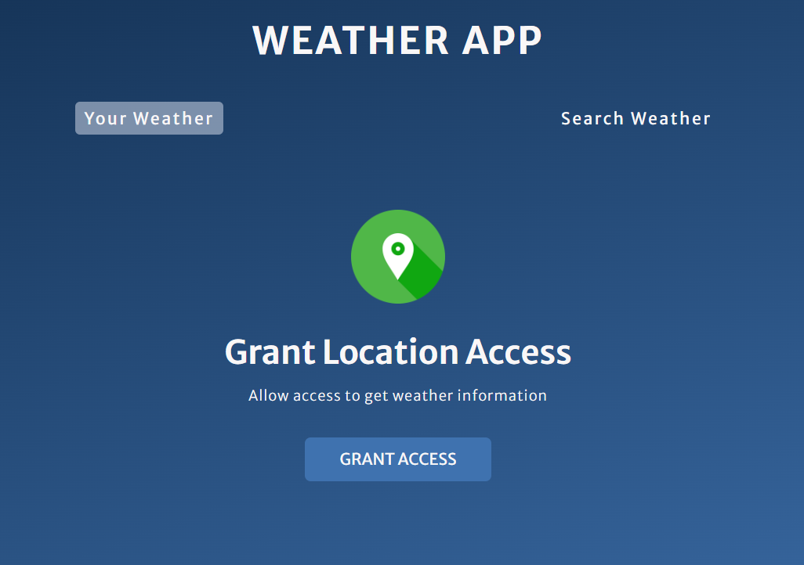
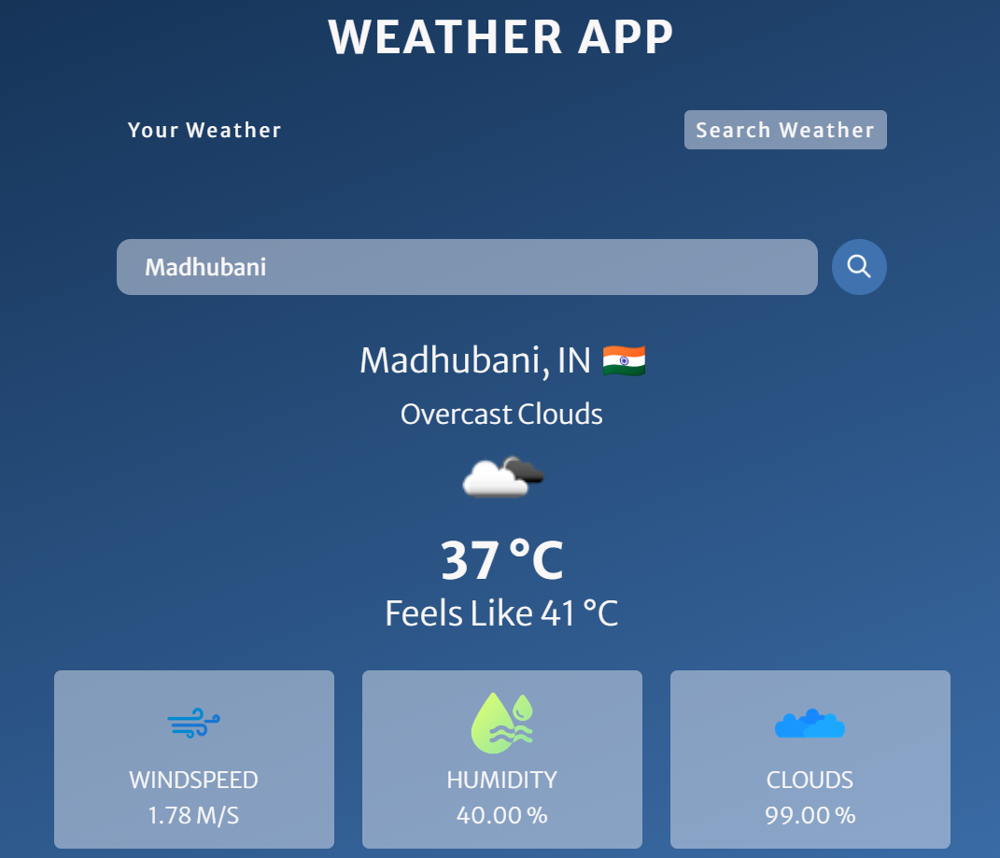

# 🌦️ Weather App — Real-Time Weather Data

A responsive and modern **Weather App** that shows real-time weather information using the **OpenWeatherMap API**. Built with **HTML**, **CSS**, and **JavaScript**, it allows users to search for any city and get current weather data including temperature, conditions, humidity, and wind speed.

---

## 🔍 Features

- 🌍 Search for any city worldwide
- 📡 Fetches **real-time weather** data via OpenWeatherMap API
- 🌡️ Displays:
  - Temperature
  - Feels Like Temperature
  - Weather description
  - Weather icon
  - Humidity
  - Wind speed
- 🖼️ Dynamic weather icon rendering
- 💻 Responsive UI
- ✨ Clean design with soft colors

---

## 🖼️ UI Screenshots

---

## Website Link

